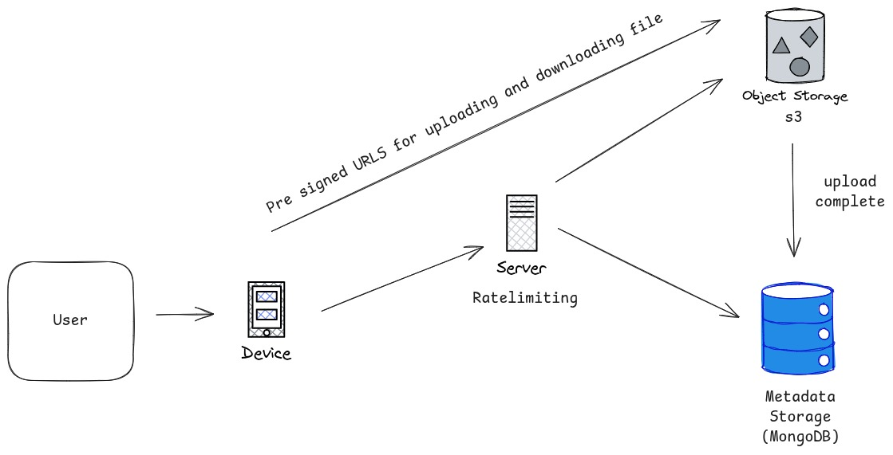

# VaultQ - Google Drive Clone

A scalable, production-ready cloud storage solution built with modern web technologies. VaultQ provides secure file storage, sharing capabilities, and Google OAuth authentication with AWS S3 integration.

## Features

- **Google OAuth Authentication** - Secure login using passport-google-oauth20
- **File Management** - Upload, download, rename, and delete files with ease
- **Smart Search** - Fast file search with indexed MongoDB queries
- **File Sharing** - Share files publicly or with specific users with granular permissions (read/write)
- **Access Control** - Owner-based permissions with public/private file settings
- **Presigned URLs** - Secure direct uploads and downloads using AWS S3 presigned URLs
- **Rate Limiting** - Protection against abuse on critical endpoints
- **File Size Limits** - Multi-layer validation (client, server, S3) for upload size control
- **Modern UI** - Beautiful, responsive interface built with Next.js and Tailwind CSS
- **Real-time Updates** - React Query for efficient data fetching and caching
- **Starred Files** - Mark important files for quick access
- **Trash Management** - Soft delete with restore capabilities
- **Recent Files** - Quick access to recently modified files
- **File Preview** - In-browser preview for images and PDFs

## Tech Stack

**Frontend:**
- Next.js 16 with React 19
- TypeScript
- Tailwind CSS
- React Query (TanStack Query)
- Lucide React Icons

**Backend:**
- Node.js with Express
- TypeScript
- MongoDB with Mongoose
- Passport.js for authentication
- AWS S3 for file storage
- Express Session with MongoDB store

## Setup Locally

### Prerequisites

- Node.js (v18 or higher)
- MongoDB (local or Atlas)
- AWS Account with S3 bucket
- Google OAuth credentials

### 1. Clone the Repository

```bash
git clone https://github.com/definitelynotchirag/vaultq
cd vaultq
```

### 2. Backend Setup

```bash
cd backend
npm install
```

Create a `.env` file in the `backend` directory:

```env
# Server
PORT=3000
NODE_ENV=development

# MongoDB
MONGODB_URI=mongodb://localhost:27017/vaultq

# Session
SESSION_SECRET=your-super-secret-session-key-change-this

# Google OAuth
GOOGLE_CLIENT_ID=your-google-client-id
GOOGLE_CLIENT_SECRET=your-google-client-secret


# AWS S3
AWS_REGION=us-east-1
AWS_ACCESS_KEY_ID=your-aws-access-key
AWS_SECRET_ACCESS_KEY=your-aws-secret-key
S3_BUCKET_NAME=your-bucket-name

# CORS
FRONTEND_URL=http://localhost:3001
```

Start the backend server:

```bash
npm run dev
```

The backend will run on `http://localhost:3000`

### 3. Frontend Setup

```bash
cd frontend
npm install
```

Create a `.env` file in the `frontend` directory:

```env
NEXT_PUBLIC_API_URL=http://localhost:3000
```

Start the frontend development server:

```bash
npm run dev
```

The frontend will run on `http://localhost:3001`

### 4. Configure Google OAuth

1. Go to [Google Cloud Console](https://console.cloud.google.com/)
2. Create a new project or select an existing one
3. Enable Google+ API
4. Create OAuth 2.0 credentials
5. Add authorized redirect URI: `http://localhost:3000/auth/google/callback`
6. Copy the Client ID and Client Secret to your backend `.env` file

### 5. Configure AWS S3

1. Create an S3 bucket in your AWS account
2. Create an IAM user with S3 access
3. Generate access keys for the IAM user
4. Configure CORS for your S3 bucket (run the setup script):

```bash
cd backend
npm run setup:s3-cors
```

## Setup Using Docker

### Prerequisites

- Docker
- Docker Compose

### 1. Clone the Repository

```bash
git clone https://github.com/definitelynotchirag/vaultq
cd vaultq
```

### 2. Configure Environment Variables

Create a `.env` file in the `backend` directory with all the required environment variables (see the local setup section for details).

### 3. Build and Run with Docker Compose

```bash
docker-compose up --build
```

This will:
- Build the backend Docker image
- Start the backend service on port 3000
- Set up networking between services

The backend will be available at `http://localhost:3000`

### 4. Run Frontend (Optional)

If you want to run the frontend in Docker as well, you can build it separately:

```bash
cd frontend
docker build -t vaultq-frontend .
docker run -p 3001:3001 vaultq-frontend
```

### 5. Stop Services

```bash
docker-compose down
```

To remove volumes as well:

```bash
docker-compose down -v
```

## Architecture



```
Client
  |
  | Google OAuth login, file CRUD requests, search, sharing, presigned URLs
  v
Backend (Node Express)
  - Google OAuth (passport-google-oauth20)
  - Session authentication protecting all file routes
  - File operations: upload url, confirm upload, list, search, rename, delete
  - Sharing logic: public flag or sharedWith user list
  - File size limits: client check + multer + S3 content length rules
  - Rate limiting for key endpoints
  |
  v
MongoDB
  - users collection: googleId, email, name
  - files collection: owner, originalName, storageName, size, timestamps, public flag, permissions array
  - text index on originalName for fast searching
  |
  v
S3 Bucket
  - actual file storage
  - direct uploads using presigned URLs from backend
  - presigned short-lived download URLs for access-controlled reads
```

## API Endpoints

### Authentication
- `GET /auth/google` - Initiate Google OAuth flow
- `GET /auth/google/callback` - OAuth callback
- `GET /auth/me` - Get current user info
- `POST /auth/logout` - Logout user
- `GET /auth/success` - Redirect to success page
- `GET /auth/failure` - Redirect to failure page

### File Operations
- `POST /files/upload-url` - Get presigned upload URL from S3
- `POST /files/confirm-upload` - Confirm upload and save metadata
- `GET /files` - List accessible files (supports ?search= query)
- `PUT /files/:id` - Rename file
- `DELETE /files/:id` - Move file to trash (soft delete)
- `GET /files/:id/download` - Get presigned download URL
- `GET /files/:id/view` - Get presigned view URL for in-browser preview

### Sharing
- `POST /files/:id/share` - Share file with specific user by userId
- `POST /files/:id/share-email` - Share file with user by email
- `POST /files/:id/public` - Make file public
- `POST /files/:id/private` - Make file private

### Starred Files
- `POST /files/:id/star` - Star a file
- `DELETE /files/:id/star` - Unstar a file
- `GET /files/starred` - List starred files (supports ?search= query)

### Trash Management
- `GET /files/trash` - List files in trash
- `POST /files/:id/restore` - Restore file from trash
- `DELETE /files/:id/permanent` - Permanently delete file from S3 and DB

### Public/Shared File Access
- `GET /shared/:fileId` - Get public or shared file details
- `GET /shared/:fileId/view` - Get view URL for public/shared file
- `GET /shared/:fileId/download` - Get download URL for public/shared file


## Main Features

- **Presigned URL Pattern** - Demonstrates understanding of scalable file handling without routing files through the backend
- **Proper Access Control** - Scoped permissions instead of naive public links
- **Indexed Search** - Prevents full collection scans for better performance
- **Rate Limiting** - Shows security awareness and production readiness
- **Multi-layer Validation** - File size limits at client, server, and S3 levels
- **Modern Stack** - Latest versions of Next.js, React, and TypeScript
- **Production Ready** - Dockerized, with proper error handling and health checks

## License

MIT
